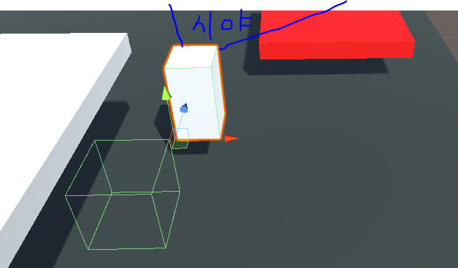
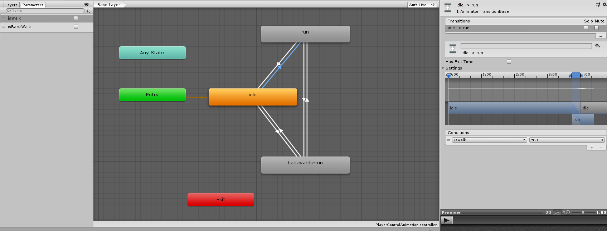

# TIL-Unity3D
 Unity3D Study with C#
-----------------------------------------
## 001. CoroutineTest.cs
 * 스크립트 설명 : 코루틴 함수를 이용하여 물체의 좌우 움직임을 지속적으로 제어한 스크립트
 * 사용 방법 : 하이러시에서 큐브를 생성하여 "TestCube" 라는 이름을 입력한 뒤 해당 스크립트를 TestCube에 드래그
 * 배운 내용 :
	- GameObject 클래스에 대한 기본 이해
	- GameObject 객체가 private인 상태에서 특정 오브젝트를 가져오는 방법에 대한 이해
	- 코루틴 함수의 기본 동작 이해 (스레드 대신 사용하면 좋음)
	- 오브젝트 기본 이동 방법에 대한 이해

-----------------------------------------
## 002. Control.cs
 * 스크립트 설명 : FPS 조작키를 이용하여 물체의 움직임, 점프를 제어할 수 있는 스크립트
 * 사용 방법 : 
	1. 오브젝트 2개를 생성한다. (예시 오브젝트 이름 : CubeGround, CubeControl)
	2. CubeControl에서 Rigidbody 컴포넌트를 추가한다. (물리, 중력 적용을 위함)
	3. CubeControl에게 이 스크립트를 드래그 앤 드롭한다.
	4. CubeGround의 태그를 Ground 혹은 MoveGround로 변경한다. (없으면 태그를 추가해야 함)

 * 배운 내용 :
	- 키 코드와 키를 입력받는 방법에 대한 이해
	- 물체 충돌을 감지하는 관련 함수들에 대한 이해
	- 직접 컴포넌트를 이용하지 않고도 옵션을 변경할 수 있는 방법에 대한 이해
	- 태그를 이용한 충돌 함수 응용

 * 참고 자료 : https://solution94.tistory.com/27

-----------------------------------------
### 003. ParentMove.cs
 * 스크립트 설명 : 플레이어가 움직이는 바닥에 닿을 시 바닥의 움직임에 따라 탈 수 있는 스크립트
 * 사용 방법 : 
	1. 조작키로 움직일 수 있는 플레이어 오브젝트를 만든다. (이름 예시 : PlayerCube, 조작 스크립트는 별도로 하기 바람) 
	2. 움직이는 바닥 오브젝트를 만들고 그룹을 "MoveGround"로 한다. (이름 예시 : TestCube, 조작 스크립트는 별도로 하기 바람)
	3. 이 스크립트를 PlayerCube에게 드래그 앤 드롭한다.

 * 배운 내용 : 
	- 오브젝트끼리 부모/자식을 코드로 설정하는 방법에 대한 이해

 * 참고 자료 : http://devkorea.co.kr/bbs/board.php?bo_table=m03_qna&wr_id=25896

-----------------------------------------
### 004. Control-2.cs
 * 스크립트 설명 : 기존 Control 스크립트에서 코루틴 함수가 추가된 스크립트로, Q키를 누를 시 이것을 적용한 오브젝트는 일정 시간 동안 빨간색으로 변하는 스크립트
 * 사용 방법 : 
	1. 컨트롤하고자 하는 오브젝트에게 이 스크립트를 드래그 앤 드롭한다.
	2. Material을 만들어서 이 스크립트의 변수 목록에서 matColor에다가 드래그 앤 드롭한다.
	3. Q키를 눌러 동작을 확인한다.

 * 배운 내용 :
	- Material 클래스에 대한 기본 이해
	- 코루틴 함수를 이용한 이펙트 지속시간 활용 이해

-----------------------------------------
### 005-1. ControlRotate.cs
 * 스크립트 설명 : 마우스를 이용하여 이 스크립트를 적용한 오브젝트를 X축으로 회전할 수 있는 스크립트
 * 사용 방법 : 
	1. 오브젝트를 만들거나 이미 이동스크립트를 적용하여 조작이 가능한 오브젝트에게 이 스크립트를 드래그 앤 드롭한다.
	2. 플레이하여 마우스를 좌우로 회전시켜본다.

### 005-2. CameraMove.cs
 * 스크립트 설명 : 오브젝트의 움직임이나 회전에 따라 카메라가 따라다니는 오브젝트.
 * 사용 방법 : 
	1. 조작 가능한 오브젝트의 이름을 ControlCube로 변경한다.
	2. 이 스크립트를 메인 카메라(Main Camera) 오브젝트에 드래그 앤 드롭한다.

 * 배운 내용 : 
	- 기본 회전에 관한 이해
	- Vector3 사용에 관한 이해
	- 포지션(위치), 회전축 설정 방법에 관한 이해

-----------------------------------------
### 006. CameraMove2.cs
 * 스크립트 설명 : 기존 CameraMove 스크립트에 y축 회전 기능이 추가된 스크립트
 * 사용 방법 : CameraMove 방식과 같음. (기존 CameraMove 스크립트를 지우고 이 스크립트를 적용한다)
 * 배운 내용 : 
	- FPS 방식으로 화면을 움직이는 방법에 관한 이해 
	- FPS 방식으로 화면을 움직일 시 화면이 뒤집어지는 문제를 해결.

-----------------------------------------
### 007. CameraMove3.cs
 
 * 스크립트 설명 : 기존 CameraMove2 스크립트에 1인칭, 3인칭 컨트롤이 추가된 스크립트
 * 사용 방법 : 
	1. 기존 CameraMove2 스크립트가 적용된 카메라 오브젝트를 선택하여 해당 스크립트를 지운다.
	2. 조작 대상 오브젝트가 ControlCube인지 확인한다. (아닐 경우 해당 이름으로 변경시킨다.)
	3. CameraLocation 이라는 이름의 빈 오브젝트를 생성하고, 위치는 조작 오브젝트(플레이어)의 좌표에 맞춰서 적용한다.
	4. CameraLocation 오브젝트를 플레이어 오브젝트의 조금 뒤에 위치시키도록 다시 이동시킨다. (그림 참고)
 * 배운 내용 : 
	- 버튼을 이용하여 시점을 바꾸는 방법

-----------------------------------------
### 008. DieZone.cs
 * 스크립트 설명 : 트리거 충돌이 일어날 경우 충돌을 발생시킨 해당 오브젝트를 지정한 스폰 포인터로 이동시키는 스크립트
 * 사용 방법 : 
	1. "[Trigger]Die" 라는 이름으로 빈 오브젝트를 생성한다.
	2. BoxCollider 컴포넌트를 생성하고 is Trigger를 체크한다.
	3. 해당 오브젝트의 크기와 위치를 적절하게 설정한다. 
	4. 해당 오브젝트에게 이 스크립트를 드래그 앤 드롭한다.

 * 배운 내용 :
	- 오브젝트 위치 변경에 관한 추가 이해
	- 트리거에 관한 기본 이해

-----------------------------------------
### 009-1. 캐릭터 애니메이션 조작하기 (part 1)
 
 * 설명 : 플레이어에 캐릭터 모델을 적용시켜서 가만히 있는 동작을 연출하도록 하기
 * 사용 방법 : 
	 1. 에셋스토어에서 "Character Pack " Free Sample" (SUPERCYAN) 을 다운받아 임포트한다.
	 2. 받은 팩의 Models폴더에서 free_male_1을 선택하고 Scale Factor를 조절한다.
	 3. (Scale Factor를 조절했을 경우) Animations 폴더에서 common_people@mpose의 Scale Factor도 똑같이 조절한다.
	 4. Models에서 free_male_1을 하이러시에 둔다. (조작 관련 스크립트나 Player 전용 오브젝트도 준비해서 적절히 합해준다.)
	 5. Materials/High Quality 폴더에 있는 텍스쳐 파일을 이용하여 캐릭터의 몸체에 붙여준다.
	 6. 프로젝트 폴더에서 마우스 우클릭 -> Create -> Animator Controller를 누른다. (이름은 PlayerControlAnimation으로 함)
	 7. PlayerControlAnimation 컨트롤러 파일을 하이러시에 있는 free_male_1의 컴포넌트에 적용시킨다.
	 8. 해당 Animator 컴포넌트의 Avartar에서 빈 칸 옆에 있는 동그란 버튼을 눌러서 등장하는 FBX 파일을 적용시킨다.
	 9. PlayerControlAnimation 컨트롤러 파일을 오픈한다.
	10. Animations/common_people@idle 내에서 idle 파일을 해당 컨트롤러의 BaseLayer에 드래그 앤 드롭한다.
	11. 실행을 눌러 캐릭터가 idle 동작을 수행하는지 확인한다.

 * 배운 내용 : 
	- 에셋 스토어에서 캐릭터 모델링을 받아오는 방법
	- 외부에서 가져온 모델링의 크기를 직접 Scale 속성에서 수정하지 않고 크기를 변경하는 방법
	- 모델링에 대한 크기 변경 후 애니메이션 사용 시, FBX 모델링에 대한 크기도 변경해야 되는 점.
	- 간단하게 애니메이션을 적용시키는 방법

 * 참고 자료 : https://jungmonster.tistory.com/194

-----------------------------------------
### 009-2. 캐릭터 애니메이션 조작하기 (part 2)
 
 * 설명 : Animator를 구성하고, 키를 누르면 달리는 동작 연출시키기
 * 사용 방법 : 
	1. PlayerControlAnimation 파일을 오픈한다.
	2. 해당 Animator의 Base Layer에서 다음과 같은 애니메이션 동작을 추가한다.
		- Animations/common_people@backwards-run\backwards-run
		- Animations/common_people@run\run
	3. idle 레이어를 우클릭하여 Make Transision을 이용하여 다른 레이어와 연결시킨다.
	4. 다른 레이어의 경우에도 그림과 같이 연결시켜준다.
	5. 모든 화살표(Transitions)에 대하여, 화살표를 클릭하여 Inspector 뷰의 Has Exit Time을 해제한다.
	6. Animator의 Parameters에서 다음과 같은 변수들을 추가한다.
		- isWalk (자료형 : bool)
		- isBackWalk (자료형 : bool)
	7. 각 화살표(Transitions)에 대하여 Inspector의 Conditions에서 다음과 같이 설정해준다.
		- (idle -> run)
			-  isWalk가 true이면 동작하도록 설정

		- (idle -> backwards-run)
			- isBackWalk가 true이면 동작하도록 설정

		- (run -> backwards-run)
			- isWalk가 false, isBackWalk가 true이면 동작하도록 설정

		- (run -> idle) , (backwards-run -> idle)
			- isWalk와 isBackWalk가 모두 false이면 동작하도록 설정

		- (backwards-run -> run)
			- isWalk가 true, isBackWalk가 false이면 동작하도록 설정

	8. CharacterAnimation.cs 파일을 해당 캐릭터 오브젝트에 적용시킨다.

 * 배운 내용 : 
	- Animator 컴포넌트를 다루는 방법에 관한 이해
	- Animator 컴포넌트의 파라미터를 이용하는 방법에 관한 이해 
	- Animator를 구성하는 방법에 관한 이해

 * 참고 자료 : https://m.blog.naver.com/game_studyz/220984736956

-----------------------------------------