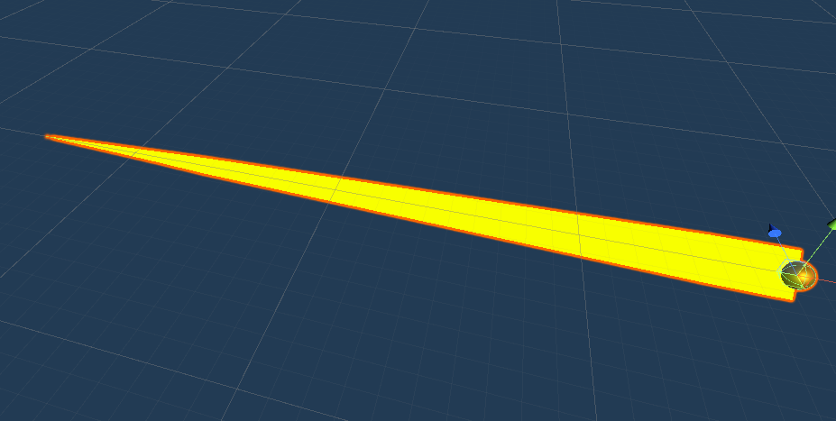

### VR002. GunShoot.cs, Bullet.cs

#### 스크립트 설명
	- GunShoot.cs : 컨트롤러의 트리거 버튼을 누를 경우 총알을 발사하는 스크립트
	- Bullet.cs : 총알(프리팹)에 적용하는 스크립트

#### 사용 방법
	1. 빈 오브젝트 생성 (이름 : Player)
	2. Player에 OVRCameraRig 프리팹 추가
	3. OVRCameraRig - RightHandAnchor - RightControllerAnchor에 OVRControllerPrefab 추가
	4. RightHandAnchor에 GunShoot 스크립트 추가
	5. Sphere 오브젝트 추가 (이름 : Bullet)
	6. Bullet를 프리팹화 시키고 크기(Scale)은 모두 0.1로 고정한다.
	7. Bullet 프리팹에 Trail Renderer 컴포넌트를 추가하고, Width 그래프에서 시작점은 0.018 끝점은 0.00으로 두어 포물선 형태로 조절한다.
	8. Trail Renderer 컴포넌트에서 Time은 0.2, MinVertexDistance는 0.1로 조절한다.
	9. Bullet 프리팹에 Rigidbody 컴포넌트를 추가한다.
	10. Bullet 프리팹에 Bullet 스크립트를 추가한다.
	11. RightHandAnchor에서 GunShoot의 Bullet에다가 Bullet 프리팹을 추가한다.
	12. 총으로 표적의 대상이 될 프리팹에 대하여 태그를 Enemy로 설정한다.

#### 조작키
	- 트리거 버튼 : 발사
	- 원형 버튼 : 재장전

#### 배운 내용
	- Trail Renederer 컴포넌트를 이용하여 궤적 효과를 만드는 방법
	- OVRInput (VR 전용 컨트롤러) 활용 방법
	
