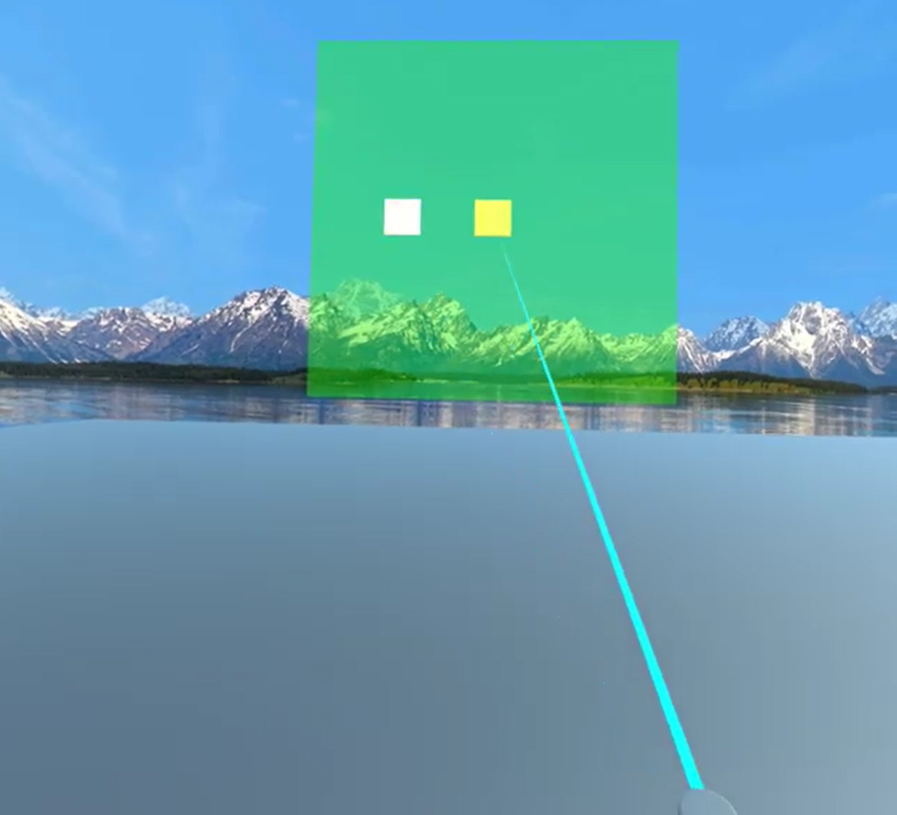

### VR006. VRPointer.cs

#### 스크립트 설명
	- Oculus GO의 컨트롤러에 레이저를 추가한 스크립트 (물체 충돌을 감지함.)

#### 추가사항
	- (2020-01-23) UI 버튼에 레이저를 댈 경우 UI 버튼 효과 작동 (현재 Enter, Exit만 구현)
	- (2020-01-23) 컨트롤러 원형 버튼을 클릭한 상태이면 색이 변경됨.

#### 사용 방법
	1. 빈 오브젝트를 만들어서 이름을 Player로 변경한다. 
	2. Player 오브젝트에 OVRCameraRig 프리팹을 넣는다.
	3. OVRCameraRig의 RightControllerAnchor에 OVRControllerPrefab 프리팹을 넣는다.
	4. 해당 프리펩에 VRPointer.cs 스크립트를 추가한다.

	(2020-01-23 추가된 사용방법)
	1. Hierarchy에서 Canvas 생성 (너비, 높이는 모두 10으로 설정)
	2. Canvas에 Panel 생성.
	3. Canvas에 Button 생성 (너비, 높이는 모두 1로 설정)
	4. 생성한 버튼의 Normal Color, Highlight Color, Pressed Color, Selected Color를 설정해준다.
	5. Button에 대하여 BoxCollider 컴포넌트를 추가한다. (사이즈에서 z축을 0으로 만든다.)

#### 배운 내용
	- 라인렌더러 정확한 포지션 계산 방법 이해 (라인렌더러 활용 이해)

	(2020-01-23)
	- VR 컨트롤러로 UI 버튼과 상호작용하는 방법