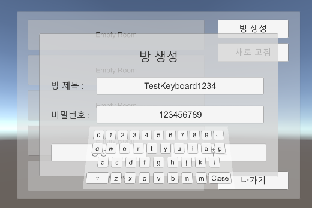

### VR009-2. 개선된 VR 키보드

#### 스크립트 설명
	- KeyboardManager.cs : 모든 키(Key)를 관리하고, 클릭한 키의 프로퍼티를 가져와서 설정된 입력 Button에 입력해주는 스크립트
	- KeySettings.cs : 키(Key) UI 전용 스크립트 KeyboardManager에 의하여 키를 세팅할 수 있음.

#### 함수 및 변수 정보
	- [KeyboardManager.cs]

	- (변수 목록)
	- GameObject targetInputButton : 입력 대상이 될 오브젝트 (UI Button 오브젝트만 해당)
	- GameObject keyboardPrefab : 실제 키보드 프리팹이 들어가는 곳
	- string[] textBigSet : 대문자 키 세팅을 위한 배열 
	- string[] textSmallSet : 소문자 키 세팅을 위한 배열
	- const int KEY_LENGTH :  키(Key) UI 프리팹의 개수를 나타냄
	- GameObject[] keys : 키(Key) UI 프리팹이 들어가는 곳

	- (함수 목록)
	- Start( ) :  
		- keys에 등록된 키 UI 프리팹의 KeySettings 컴포넌트를 가져와서 대/소문자를 세팅 후 키보드 프리팹을 비활성화시킴.

	- OnInputButtonClick( ) : 
		- 이벤트 메소드로, 클릭한 Button에 대하여 입력 대상이 됨.
		- 텍스트가 포함된 버튼의 OnClick에서 이 스크립트가 적용된 오브젝트를 가져와서 이 함수를 적용시키면 됨.

	- OnKeyButtonClickInChildren(string text) : 
		- 이벤트 메소드로, 클릭한 Button으로부터 string 을 가져옴
		- KeyboardManager.cs 에 의해 KeySettings.cs가 적용된 Key UI가 버튼 클릭으로 인해 이벤트가 발생할 경우 호출됨.
		- 가져온 문자에 따라 아래와 같이 처리됨
			- 알파벳 : 입력 대상이 된 버튼의 텍스트에 해당 알파벳이 입력됨
			- '←' : 입력 대상이 된 버튼의 텍스트의 맨 앞 문자가 지워짐
			- '▲' : 소문자로 변환됨 (원래 대문자로 변환할 의도였음..)
			- '▽' : 대문자로 변환됨 
			- "Close" : VR 키보드를 비활성화함
