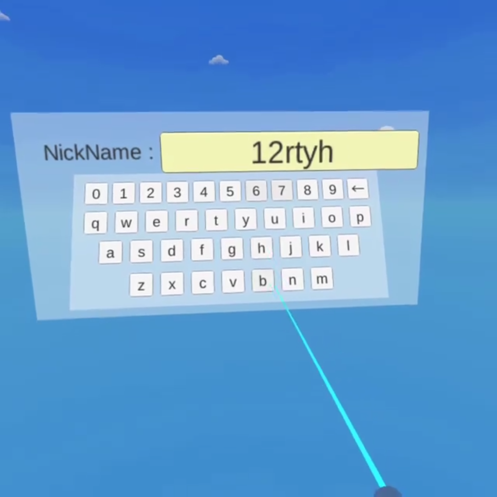

### VR008. VR 키보드 만들기 & 입력 테스트

#### 스크립트 설명
	- ButtonKey.cs : 단축키 UI 프리팹 전용. 키보드처럼 사용할 수 있는 환경을 위한 스크립트
	- LoginUI.cs : 로그인 UI 창 전용. 키보드 오브젝트 관리 및 특정 버튼 클릭을 제어하는 스크립트
	- VRController.cs : VR 컨트롤러 전용. UI 버튼을 감지 및 클릭을 위한 스크립트

#### 사용 방법
	1. Player 생성
		- Hierarchy에서 빈 오브젝트 생성 후 Player로 이름 변경 (위치 : 0, 0, 0)
		- Player에 Capsule 오브젝트, OVRCameraRig 프리팹 추가
		- OVRCameraRig - TrackingSpace - Left/RightControllerAnchor에 OVRControllerPrefab 추가
		- (Oculus Go기준) OculusGoControllerModel에 VRController.cs 추가 (나머지 모델은 비활성화)

	2. 로그인 창 만들기
		- Hierarchy에 Canvas를 만들고 UI_LoginCanvas로 이름 변경 (위치 : 0, 0, 15), (크기 : W - 20, H - 10)
		- UI_LoginCanvas의 Canvas 컴포넌트에서 Render Mode를 "World Space"로 변경
		- UI_LoginCanvas에 LogInUI.cs 스크립트 추가
		- UI_LoginCanvas에 Panel 생성. (Image 컴포넌트의 Source Image는 None 설정)
		- Panel에 Text 오브젝트 생성 (크기 : W - 350, H - 150), (Scale 크기 : 0.05, 0.05, 0.05)
		- 해당 Text의 Text 컴포넌트에서 텍스트 내용을 "NickName : "으로 변경
		- Panel에 Button 오브젝트 생성 후 이름을 NickNameButton으로 변경
		- NickNameButton의 위치 : (3.13, 3.13, 0) 크기(W - 259, H - 40), Scale 크기(0.05, 0.05, 0.05)로 설정
		- NickNameButton에 BoxCollider 컴포넌트 추가 (Center : -0.098142, -0.026794, 0), (Size : 255.6978, 36.49104, 1)
		- NickNameButton의 OnClick 항목에서 오브젝트 빈칸에 UI_LoginCanvas 집어넣고, LogInUI.NickNameButtonClick으로 설정
		- NickNameButton의 Tag를 Button으로 설정

	3. 키보드 UI 창 만들기
		- Hierarchy에 Canvas를 만들고 KeyboardCanvas로 이름 변경 (위치 : 0, 0, 5), (크기 : W - 525, H - 225), (Scale : 모두 0.1)
		- KeyboardCanvas의 Canvas 컴포넌트에서 Render Mode를 "World Space"로 변경
		- KeyboardCanvas에 Panel를 추가하고 해당 패널의 이름을 KeyboardPanel로 변경
		- KeyboardPanel의 Image 컴포넌트에서 Source Image를 None으로 설정
		- KeyboardPanel에 빈 오브젝트를 추가하고 이름을 KeyboardButtonSet로 설정
		- KeyboardButtonSet에 Button 추가하고 이름을 KeyboardButton으로 변경 (크기 : W - 40, H - 40)
		- KeyboardButton에 Box Collider를 콜라이더 범위를 사용자가 적절히 조절한다.
		- KeyboardButton에 ButtonKey.cs 스크립트를 추가한다.
		- KeyboardButton의 Tag를 Button으로 설정
		- KeyboardButton을 프리팹화한다.
		- KeyboardButton 프리팹을 이용하여 사용자가 직접 키보드 형식으로 버튼을 배열해본다. (노가다 필요)
		- TIP1 : 각 키의 대문자, 소문자 설정 시 ButtonKey.cs의 Key_big엔 대문자를, Key_small엔 소문자를 넣으면 된다.
		- TIP2 : 여기서 지우기는 '←' 문자를 사용하였으며 해당 키의 대문자, 소문자는 모두 해당 문자로 설정하면 된다.

#### 배운 내용
	- String의 Remove( ) 메서드의 이해
	- AddListener 메서드를 이용하여 버튼 이벤트를 동적으로 추가하는 방법

#### 수정 사항
	- (2020-02-09) 버튼에 포인터를 위치하다가 벗어날 경우 버튼 상태가 제대로 갱신되지 않는 버그 수정
	- (2020-02-09) 비활성화인 버튼을 눌렀을 경우 버튼 이벤트가 발생되는 버그 수정

#### 참고 자료
 - [String Remove()](https://docs.microsoft.com/ko-kr/dotnet/api/system.string.remove?view=netframework-4.8)
 - [Button.AddListener()](https://docs.unity3d.com/2019.1/Documentation/ScriptReference/UI.Button-onClick.html)
 - [Keyboard UI 참고](http://talesfromtherift.com/vr-canvas-keyboard/)
 - [BOXOPHOBIX 배경 에셋](https://assetstore.unity.com/packages/vfx/shaders/free-skybox-cubemap-extended-shader-standard-edition-107400)
