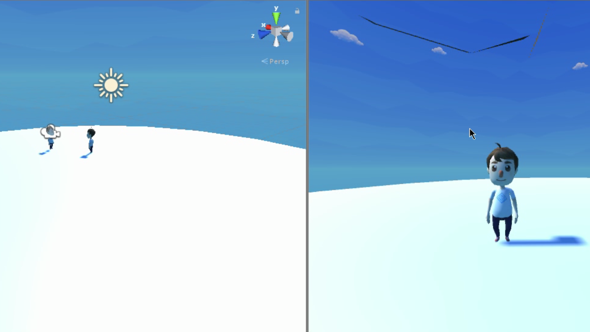

### VR011. 포톤(Photon) 네트워크 테스트

 :bangbang: 본 문서는 포톤 네트워크를 이용한 구체적인 구현 방법은 다루지 않음. 따라서 스크립트 내용은 참고용으로만 사용하길 바람.

#### 스크립트 설명
	- PhotonInit.cs : DB에서 사용자 닉네임 정보를 가져온 뒤 로그인하고 방을 만들거나 참가하여 다른 플레이어와 네트워크 통신을 가능하게 하는 스크립트
	- PlayerMove.cs : 플레이어의 움직임을 제어하는 스크립트. (본인만 조작할 수 있도록 구현됨.)

#### 사용 방법
	1. 포톤(Photon) 기본 세팅
		- 유니티의 에셋 스토어에서 PUN2 검색 후 "PUN2 - FREE"를 다운로드/임포트한다.
		- [포톤 사이트](https://www.photonengine.com/ko-KR/Photon)에 접속하여 로그인 or 회원가입을 진행
		- 로그인 이후 Photon Cloud 관리 화면으로 이동
		- "새 어플리케이션 만들기" 클릭 후 Photon 종료와 이름을 작성 후 "작성하기" 클릭
		- 생성된 어플리케이션의 ID를 복사한다.
		- 유니티 상단의 Window -> Photon Unity Networking -> PUN Wizard 선택
		- Setup Project를 선택하고 입력 창에 방금 복사했던 ID를 붙여넣기하고 적용한다.

	2. 네트워크상에서 Player 생성, 조작, 인식 방법 (플레이어 위치, 애니메이터 동기화 포함)
		- Animator가 있는 오브젝트를 가지고 이름을 Player로 변경
		- 아래와 같은 컴포넌트, 스크립트 추가
			- Rigidbody
			- Capsule Collider
			- PhotonTransformView.cs
			- PhotonAnimatorView.cs
			- PhotonView.cs
			- PlayerMove.cs (이 문서에 존재함)
		- PhotonAnimatorView.cs에 있는 애니메이션 동작에 대한 설정을 모두 Discrete로 설정
		- PhotonView의 Observed Components에 2개의 스크립트를 적용
			- PhotonTransformView.cs
			- PhotonAnimatorView.cs
		- 해당 Player 오브젝트를 Assets/Resources 폴더에 넣어 프리팹화한다.

	3. 네트워크 로그인 및 연결(방 생성/접속) 방법 (참고용)
		- 빈 오브젝트를 만들어서 PhotonManager로 이름을 변경한 뒤 해당 오브젝트에 PhotonInit.cs 스크립트를 적용한다.

#### 동작 방식
	- 포톤 네트워크에 의해 로그인이 성공할 경우 열려있는 방을 탐색함.
	- 방이 없을 경우 -> 방을 새로 생성하여 다른 플레이어의 접속을 수용함.
	- 방이 있을 경우 -> 해당 방에 접속하여 다른 플레이어와 네트워킹 가능.

#### 주의사항
	- 카메라의 경우 플레이어가 접속할 때마다 카메라가 생성되게 해서는 안되며, Hierarchy 내에서 하나만 생성해둔다.
	- 그리고 OnJoinedRoom( )이 호출될 경우 PhotonNetwork의 Instantiate에 의해 생성된 플레이어의 자식 오브젝트가 되도록 하면 된다.

#### 배운 내용
	- 포톤(Photon)을 이용한 네트워크 기능 구현 (기본)
	- 씬 전환 시 라이트 오류 해결 방법

#### 참고 자료
 - [씬 변경 시 라이트 오류 해결 방법](https://codingmania.tistory.com/202)
 - [포톤 RPG 만들기](https://you-rang.tistory.com/204)
 - [포톤 로비, 룸](https://photonkr.tistory.com/23)
 - [포톤2를 활용한 탱크 만들기](https://you-rang.tistory.com/198)