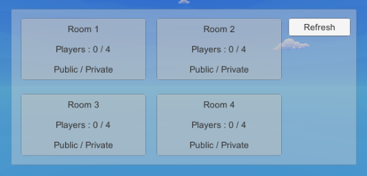

### VR012. 포톤 네트워크, 방 목록 만들기 테스트

 :bangbang: 본 문서는 포톤 네트워크를 이용한 구체적인 구현 방법은 다루지 않음. 따라서 스크립트 내용은 참고용으로만 사용하길 바람.
 :bangbang: 아직 미완성된 문서입니다.

#### 스크립트 설명
	- PhotonManager.cs : 포톤 로비 생성, 방 생성, 방 검색, 방 접속 등 좀 더 복잡한 포톤 네트워크 관련 기능들을 수행하는 스크립트.
	- PhotonRoomInfo.cs : (방 버튼 전용) 방 이름, 패스워드, 플레이어 수 등 여러 프로퍼티가 정의되어있는 스크립트
	- PhotonInit2.cs : 이전 씬에서 생성된 오브젝트를 이용하여 호스트인지 아닌지 여부를 판단하고, 방 네트워크 기능을 수행하는 스크립트

#### 업데이트 기록
	- (2020-02-06) PhotonManager.cs 스크립트 수정
		- 방이 갱신될 경우 1개 이상의 방이 존재하면 해당 정보를 이용하여 방 버튼 텍스트에 표시 및 활성화함.
		- (GameObject 배열 변수를 추가하여 이 변수 안에 버튼 게임 오브젝트들을 넣어서 관리함.)
	- (2020-02-06) PhotonRoomInfo.cs 스크립트 추가
		- 버튼 게임 오브젝트 전용 스크립트로, 방 정보와 관련된 프로퍼티들이 정의되어 있음.
	- (2020-02-07) PhotonManager.cs 스크립트 수정(2)
		- 방 생성 시 or 방 접속 시 게임 씬으로 변경되는 기능 추가
		- 방(Room) 생성 창 UI 활성화/비활성화 기능 추가 (주의 : 임의로 만든 오브젝트이므로 참고 바람.) 
		- VR 키보드용 UI 활성화/비활성화 기능 추가 (주의 : 임의로 만든 오브젝트이므로 참고 바람.)
	- (2020-02-07) PhotonInit2.cs 스크립트 추가

#### 사용 방법
	1. 포톤(Photon) 기본 세팅
		- VR011 문서 참조

	2. 로비 접속 방법
		- OnConnectedToMaster 오버라이드 함수 내에서 PhotonNetwork.JoinLobby( )를 호출.
		- 로비 접속이 성공적으로 완료되면 OnJoindLobby( ), OnRoomListUpdate( ) 오버라이드 함수가 호출됨.

	3. 방 갱신 방법
		- LeaveLobby( )를 이용하여 로비를 나갔다가 다시 JoinLobby( )를 호출. 

#### 주의사항
	- 오버라이드로 선언된 함수들은 콜백(Callback) 방식으로 동작함.
	- 2개의 디바이스를 이용하여 실험을 진행하였음.
		- 디바이스 1(VR)은 방을 생성하고, 디바이스 2(Unity Debug)는 방을 생성하지 않고 콘솔 창을 통해 방 리스트를 확인하였음.

#### 배운 내용
	- 포톤(Photon) 방 검색 방법
	- 포톤(Photon) 일부 오버라이드(콜백) 함수의 용도 이해
	- (2020-02-07) 씬이 변경되어도 제거되지 않는 오브젝트 만드는 방법
	- (2020-02-07) System.Obsolve 네임스페이스 없이 게임오브젝트 활성화/비활성화 방법
	- (2020-02-07) 인덱서로 자식 오브젝트 찾는 방법

#### 참고 자료
 - [포톤 로비 만들기](https://icechou.tistory.com/305)
 - [How to list rooms PUN2](https://answers.unity.com/questions/1562217/how-to-list-rooms-pun-2.html)
 - [인덱서로 자식 오브젝트 찾기](https://funfunhanblog.tistory.com/21)
 - [씬 변경되어도 유지되는 오브젝트 만드는 방법](https://bluemeta.tistory.com/19)