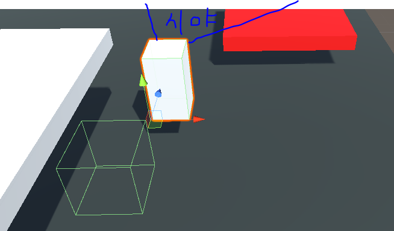

### 007. CameraMove3.cs

 

#### 스크립트 설명
	- 기존 CameraMove2 스크립트에 1인칭, 3인칭 컨트롤이 추가된 스크립트

#### 사용 방법 
	1. 기존 CameraMove2 스크립트가 적용된 카메라 오브젝트를 선택하여 해당 스크립트를 지운다.
	2. 조작 대상 오브젝트가 ControlCube인지 확인한다. (아닐 경우 해당 이름으로 변경시킨다.)
	3. CameraLocation 이라는 이름의 빈 오브젝트를 생성하고, 위치는 조작 오브젝트(플레이어)의 좌표에 맞춰서 적용한다.
	4. CameraLocation 오브젝트를 플레이어 오브젝트의 조금 뒤에 위치시키도록 다시 이동시킨다. (그림 참고)

#### 배운 내용 
	- 버튼을 이용하여 시점을 바꾸는 방법
