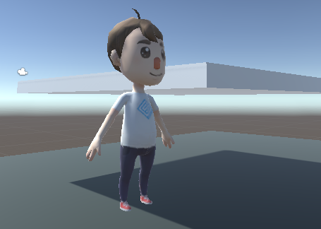
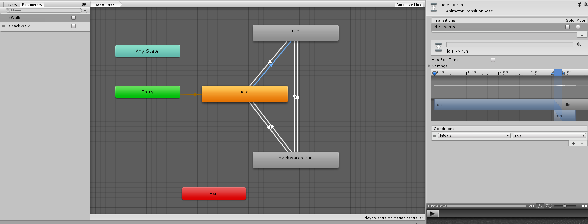
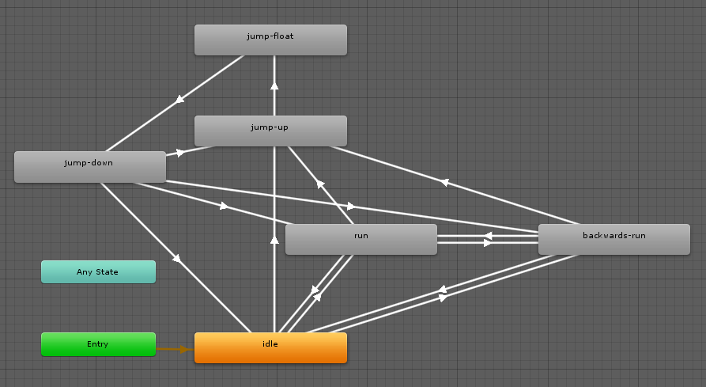

### 009-1. 캐릭터 애니메이션 조작하기 (part 1)
 
 * 설명 : 플레이어에 캐릭터 모델을 적용시켜서 가만히 있는 동작을 연출하도록 하기
 * 사용 방법 : 
	 1. 에셋스토어에서 "Character Pack " Free Sample" (SUPERCYAN) 을 다운받아 임포트한다.
	 2. 받은 팩의 Models폴더에서 free_male_1을 선택하고 Scale Factor를 조절한다.
	 3. (Scale Factor를 조절했을 경우) Animations 폴더에서 common_people@mpose의 Scale Factor도 똑같이 조절한다.
	 4. Models에서 free_male_1을 하이러시에 둔다. (조작 관련 스크립트나 Player 전용 오브젝트도 준비해서 적절히 합해준다.)
	 5. Materials/High Quality 폴더에 있는 텍스쳐 파일을 이용하여 캐릭터의 몸체에 붙여준다.
	 6. 프로젝트 폴더에서 마우스 우클릭 -> Create -> Animator Controller를 누른다. (이름은 PlayerControlAnimation으로 함)
	 7. PlayerControlAnimation 컨트롤러 파일을 하이러시에 있는 free_male_1의 컴포넌트에 적용시킨다.
	 8. 해당 Animator 컴포넌트의 Avartar에서 빈 칸 옆에 있는 동그란 버튼을 눌러서 등장하는 FBX 파일을 적용시킨다.
	 9. PlayerControlAnimation 컨트롤러 파일을 오픈한다.
	10. Animations/common_people@idle 내에서 idle 파일을 해당 컨트롤러의 BaseLayer에 드래그 앤 드롭한다.
	11. 실행을 눌러 캐릭터가 idle 동작을 수행하는지 확인한다.

 * 배운 내용 : 
	- 에셋 스토어에서 캐릭터 모델링을 받아오는 방법
	- 외부에서 가져온 모델링의 크기를 직접 Scale 속성에서 수정하지 않고 크기를 변경하는 방법
	- 모델링에 대한 크기 변경 후 애니메이션 사용 시, FBX 모델링에 대한 크기도 변경해야 되는 점.
	- 간단하게 애니메이션을 적용시키는 방법

 * 참고 자료 : https://jungmonster.tistory.com/194

-----------------------------------------
### 009-2. 캐릭터 애니메이션 조작하기 (part 2)
 
 * 설명 : Animator를 구성하고, 키를 누르면 달리는 동작 연출시키기
 * 사용 방법 : 
	1. PlayerControlAnimation 파일을 오픈한다.
	2. 해당 Animator의 Base Layer에서 다음과 같은 애니메이션 동작을 추가한다.
		- Animations/common_people@backwards-run\backwards-run
		- Animations/common_people@run\run
	3. idle 레이어를 우클릭하여 Make Transition을 이용하여 다른 레이어와 연결시킨다.
	4. 다른 레이어의 경우에도 그림과 같이 연결시켜준다.
	5. 모든 화살표(Transitions)에 대하여, 화살표를 클릭하여 Inspector 뷰의 Has Exit Time을 해제한다.
	6. Animator의 Parameters에서 다음과 같은 변수들을 추가한다.
		- isWalk (자료형 : bool)
		- isBackWalk (자료형 : bool)
	7. 각 화살표(Transitions)에 대하여 Inspector의 Conditions에서 다음과 같이 설정해준다.
		- (idle -> run)
			-  isWalk가 true이면 동작하도록 설정

		- (idle -> backwards-run)
			- isBackWalk가 true이면 동작하도록 설정

		- (run -> backwards-run)
			- isWalk가 false, isBackWalk가 true이면 동작하도록 설정

		- (run -> idle) , (backwards-run -> idle)
			- isWalk와 isBackWalk가 모두 false이면 동작하도록 설정

		- (backwards-run -> run)
			- isWalk가 true, isBackWalk가 false이면 동작하도록 설정

	8. CharacterAnimation_old.cs 파일을 해당 캐릭터 오브젝트에 적용시킨다.

 * 배운 내용 : 
	- Animator 컴포넌트를 다루는 방법에 관한 이해
	- Animator 컴포넌트의 파라미터를 이용하는 방법에 관한 이해 
	- Animator를 구성하는 방법에 관한 이해

 * 참고 자료 : https://m.blog.naver.com/game_studyz/220984736956

-----------------------------------------
### 009-3. 캐릭터 애니메이션 조작하기 (part 2)
 
 * 설명 : 
 * 사용 방법 : 
	1. PlayerControlAnimation 파일을 오픈한다.
	2. 해당 Animator의 Base Layer에서 다음과 같은 애니메이션 동작을 추가한다.
		- Animations/common_people@jump-up
		- Animations/common_people@jump-float
		- Animations/common_people@jump-down
	3. Animator의 Parameters에서 bool형 isJump 파라미터를 만든다. 
	4. 각 레이어를 우클릭하여 Make Transition 을 이용하여 위 그림과 같이 연결한다.
	* (추가사항)
		= (idle -> jump-up)
			- isJump가 true일때 동작하도록 설정.
			- Has Exit Time 체크를 해제한다.

		= (jump-up -> jump-float)
			- 변경사항 없음.

		= (jump-float -> jump-down)
			- isJump가 false일때 동작하도록 설정.
			- Has Exit Time 체크를 해제한다.
		
		= (jump-down -> idle)
			- isJump가 false일때 동작하도록 설정.

		= (jump-down -> run)
			- isJump가 false이고, isWalk가 true일때 동작하도록 설정.
			- Has Exit Time 체크를 해제한다.

		= (jump-down -> backwards-run)
			- isJump가 false이고, isBackWalk가 true일때 동작하도록 설정.
			- Has Exit Time 체크를 해제한다.

		= (jump-down -> jump-up)
			- isJump가 true일때 동작하도록 설정.
			- Has Exit Time 체크를 해제한다.

	* (변경사항)
		= (run -> idle), (backwards-run -> idle)
			- isJump가 false여야 하는 조건을 추가한다.

	5. 기존 CharacterAnimation.cs 혹은 CharacterAnimation_old.cs가 캐릭터 오브젝트에 적용 중일 경우 제거하고 새로운 CharacterAnimation.cs를 적용시킨다.

 * 배운 내용 : 
	- 부모 오브젝트로부터 컴포넌트, 스크립트를 받아오는 방법
	- 리지드바디의 velocity.normalized.y를 이용한 점프 상태(점프 중, 낙하 중)의 이해
	- horizontal, vertical을 이용하여 키 입력 감지 없이 물체의 움직임을 감지하는 방법에 관한 이해
