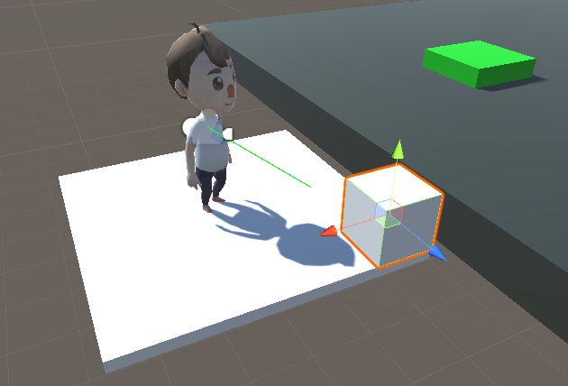

### 014. ElevatorMove.cs

 

 * 스크립트 설명 : 간단한 엘리베이터와 같은 역할을 하는 오브젝트

 * 사용 방법 : 
	1. Hierarchy에서 Cube를 생성한다. (이름은 Elevater로 설정함)
	2. Elevator의 Transform-Scale을 (x : 5, y : 0.2, z : 5) 로 조절한다.
	3. Elevator의 태그를 MoveGround로 설정한다.
	4. Elevator에게 ElevatorMove 스크립트를 적용한다.
	5. 다시 Cube를 생성한다. (이름은 button으로 설정함)
	6. Elevator와 부착하기 위해 크기와 위치를 적절히 조절한다.
	7. Hierarchy에서 button을 Elevator에 드래그 앤 드롭한다. (button은 Elevator의 자식)
	8. 새로 수정된 ParentMove.cs를 캐릭터에게 다시 적용시킨다. (003 실험과 연계됨)
	9. 새로 수정된 RaycastCam.cs를 카메라에게 다시 적용시킨다. (013 실험과 연계됨)

 * 주의사항 : 
	- 본 스크립트는 이전에 완료하였던 실험과 연계되어 진행됨.
	- 캐릭터를 FPS 방식으로 조종할 수 있어야 함. 

 * 배운 내용 :
	- 마우스 클릭 이벤트에 관한 이해
	- RayCast 활용 이해

 * 변경사항 : 
 #### ParentMove.cs
	- 충돌한 대상이 MoveGround 태그를 가진 오브젝트일 경우 해당 오브젝트의 transform을 가져온 다음 해당 오브젝트의 부모가 되도록 설정함.

 #### RaycastCam.cs
	- 마우스를 클릭했을 때 일정 범위 내에서 감지된 대상이 "button"이름을 가진 오브젝트일 경우 Elevator 오브젝트로부터 ElevatorMove 컴포넌트를 가져온 뒤 setUpDownMode를 호출하여 엘리베이터가 작동되도록 설정함.

 #### ElevatorMove.cs (19-12-26)
	- 엘리베이터 버튼 클릭 시 발생하는 작동 방식(로직) 변경.
	- 엘리베이터가 부드럽게 움직이도록 수정함.