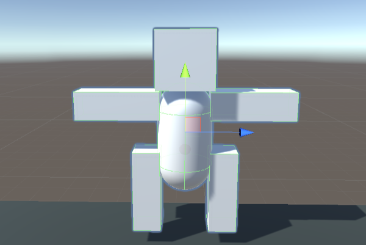

### 015-2. Fire.cs

#### 스크립트 설명 
	- 기존 Bullet에 부위별 충돌 및 트리거 감지 요소가 추가됨.

#### 사용 방법 : 
	1. Hierarcht에서 빈 오브젝트 생성 (이름 : Robot)
	2. 5가지의 태그를 만든다 : Robot, chHead, chBody, chArm, chLeg
	3. Robot에 cube 2개를 생성하고 이름은 각각 leg1, leg2로 한다. 
		- leg1 Position(0, -1, 0.7) Scale(0.5, 1.5, 0.5), Tag : chLeg
		- leg2 Position(0, -1, -0.7) Scale(0.5, 1.5, 0.5), Tag : chLeg
	4. Robot에 capsule 1개를 생성하고 이름은 Body로 한다. (Tag : chBody)
	5. Robot에 cube 2개를 생성하고 이름은 각각 arm1, arm2로 한다.
		- arm1 Position(0, 0.6, 1.2), Scale(0.5, 1.5, 0.5), Tag : chArm
		- arm2 Position(0, 0.6, -1.2), Scale(0.5, 1.5, 0.5), Tag : chArm
	6. Robot에 cube 1개를 생성하고 이름은 Head로 한다. 
		- Head Position(0, 1.4, 0), Tag : chHead
	7. Robot에 Rigidbody 컴포넌트들을 추가한다.
	8. 발사체 관련 기존 Fire.cs 를 지우고 새로운 Fire.cs를 적용시킨다.
	9. 발사체를 이용하여 로봇의 부위를 맞춰본다.
		

#### 주의사항 : 
	- 만약 부위별로 Collision을 적용했을 경우 트리거를 이용하여 물체 감지 시 부위별로 감지되는 문제가 있음.

#### 배운 내용 :
	- 태그를 이용한 부위별 충돌, 트리거 감지 활용