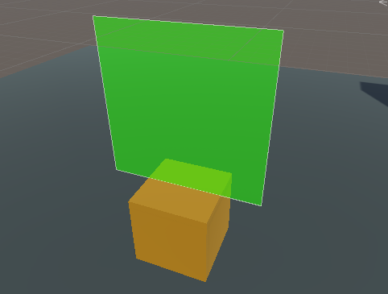

### 018. UITrigger.cs

 

#### 스크립트 설명
 - 물체에 가까이 접근할 경우 UI가 나타나게 하는 스크립트
 - (추가) 플레이어와의 거리에 따라 투명도 조절 및 플레이어를 계속 바라보게 하는 스크립트

#### 사용 방법
 1. Hierarchy에서 Cube를 생성한다. (이름 : UICube)
 2. UICube에 빈 오브젝트를 추가한다. (이름 : Range)
 3. Range 오브젝트에 Sphere Collider 컴포넌트를 추가하고 Radius를 5 ~ 10으로 맞춘다.
 4. UICube에 Canvas를 추가한다. (마우스 우클릭 -> UI -> Canvas 선택)
 5. Canvas의 Canvas 컴포넌트에서 Render Mode를 World Space로 변경한다.
 6. Canvas의 Rect Transform 컴포넌트에서 Width와 Height를 2로 맞춘다. (위치는 UICube에 맞게 조절)
 7. Canvas에 빈 오브젝트를 추가한다. (이름 : HelloWorld)
 8. HelloWorld 오브젝트에 Image 컴포넌트를 추가한다.
 9. UICube에게 UITrigger.cs 스크립트를 추가한다.

#### 주의사항
 - 본 스크립트는 이전에 완료하였던 실험과 연계되어 진행됨.
 - 캐릭터를 FPS 방식으로 조종할 수 있어야 함. 

#### 배운 내용
 - UI을 다룰 경우 UnityEngine.UI를 추가해야 한다는 점.
 - 자식 오브젝트의 컴포넌트를 불러오는 방법
 - Image 컴포넌트의 Color를 변경하는 방법 (투명도 포함)
 - 트리거를 이용하여 들어온 물체를 감지하는 방법
 - (12/31) UI의 Rect Transform 컴포넌트에 접근하는 방법
 - (12/31) 특정 물체를 계속 바라보게 만드는 방법
 - (12/31) 플레이어와 물체 간의 거리를 계산하는 방법

#### 참고 자료
 - [특정 대상 바라보기](https://legacy.tistory.com/81)
 - [거리 관련 오브젝트 반응](https://funfunhanblog.tistory.com/29)
 - [퍼센트 계산법](http://mwultong.blogspot.com/2008/01/percent-formula.html)