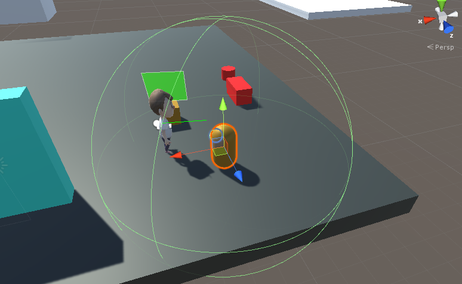

### 019. ChaserPlayer.cs

 

#### 스크립트 설명
	- 플레이어가 접근할 경우 플레이어 쪽으로 부드럽게 방향을 전환하면서 플레이어를 추적하는 스크립트
	- 플레이어와 일정 이상 가까우면 움직임을 멈추는 스크립트

#### 사용 방법
	1. Hierarchy에서 Capsule 오브젝트를 생성한다. (이름 : Pet)
	2. Pet에다가 빈 오브젝트를 생성한다. (이름 : Range)
	3. Range에게 Sphere Collider 컴포넌트를 추가하고 Radius를 5 ~ 10으로 맞춘다.
	4. Pet에다가 Sphere 오브젝트를 생성하고, Position을 (0, 0.5, 0.4)로 맞춘다.
	5. Pet에다가 ChaserPlayer.cs 스크립트를 추가한다.

#### 주의사항
	- 본 스크립트는 이전에 완료하였던 실험과 연계되어 진행됨.
	- 캐릭터를 FPS 방식으로 조종할 수 있어야 함. 
	- 캐릭터의 태그가 "Player"이어야 함.

#### 배운 내용
	- Lerp를 이용하여 부드럽게 이동, 회전하는 방법
	- 플레이어와 오브젝트 거리를 이용한 응용

#### 참고 자료
 - [특정 대상 바라보기2](https://mentum.tistory.com/227)
 - [Lerp를 이용한 부드러운 회전](http://devkorea.co.kr/bbs/board.php?bo_table=m03_qna&wr_id=59537)
 - [Lerp를 이용한 부드러운 이동](https://iygames.tistory.com/6)