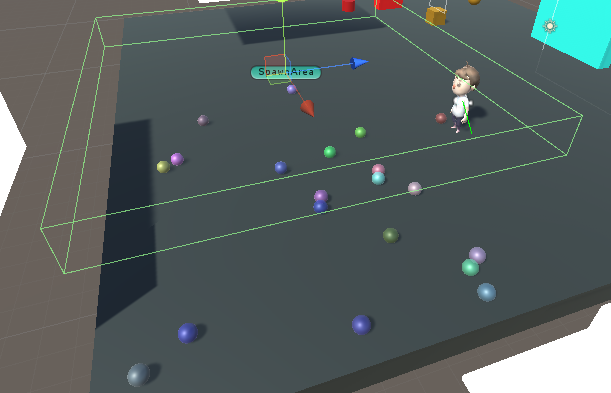

### 020. SpawnObject.cs

 

#### 스크립트 설명
 - 1~5초 간격으로 랜덤한 위치에서 랜덤한 색상을 가진 반투명한 공을 생성하는 스크립트
 + 공이 생성될 때 일정 시간이 지나면 사라지게 만드는 내부 클래스 추가

#### 사용 방법
	1. Hierarchy에서 빈 오브젝트를 생성한다. (이름 : SpawnArea);
	2. SpawnArea에 Box Collider 컴포넌트를 추가한다.
	3. SpawnArea의 Transform의 Scale을 (10, 1, 10)으로 조절한다.
	4. SpawnArea를 원하는 위치에 둔 다음 SpawnObject.cs 스크립트를 추가한다.

#### 배운 내용
 - MeshRenderer 컴포넌트를 이용하여 Material을 조작하는 방법
 - GameObject를 스크립트에서 생성하고 초기화하는 방법
 - Material의 모드를 스크립트에서 변경하는 방법
 - 유니티의 Random 클래스 사용 방법 
 + 내부 클래스를 이용하여 컴포넌트 생성/불러오기 방법

#### 참고 자료
 - [유니티 Random.Range( )](https://codingmania.tistory.com/168)
 - [스크립트를 이용하여 셰이더 변수에 접근하기](https://mingyu0403.tistory.com/120)
 - [Material의 Rendering Mode를 스크립트에서 변경하기](https://answers.unity.com/questions/1004666/change-material-rendering-mode-in-runtime.html)