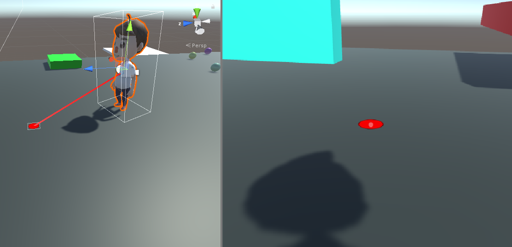

### 022. DrawLine.cs, RayCastCam.cs

 

#### 스크립트 추가사항
+ RayCastCam.cs 스크립트에서 감지 거리는 DrawLine.cs 스크립트에 의해 결정되도록 수정
+ 플레이어가 오브젝트를 일정 거리 이내에 바라볼 경우 그 지점에 원이 표시되도록 구현함.

#### 사용 방법
- MainCamera에 적용했던 DrawLine.cs, RayCastCam.cs 기존 스크립트를 제거하고 새로운 스크립트를 추가한다.
- Hierarchy에서 빈 오브젝트 생성(이름은 반드시 "Pointer"로 설정)
- Pointer의 Scale을 모두 0.4로 조절
- Pointer 오브젝트를 우클릭 후 UI -> Image 클릭
- Canvas 오브젝트의 Width, Height를 각각 1로, Rotation을 (90, 0, 0), Scale을 (1, 1, 1)로 설정
- Image 오브젝트의 Width, Height를 각각 1로, Scale을 (1, 1, 1)로 설정.
- Image 오브젝트의 Image 컴포넌트에서 Source Image를 Knob로 설정한다. (우측 원형 버튼 눌러서 적용 가능)

#### 주의사항
- 본 스크립트는 이전에 완료하였던 실험과 연계되어 진행됨.
- 캐릭터를 FPS 방식으로 조종할 수 있어야 함. 

#### 배운 내용
- 오브젝트 활성화/비활성화하는 방법
- 일정 범위 내에 오브젝트 감지 시 해당 위치값을 가져오는 방법 (RayCastHit.point)

#### 참고 자료
- [충돌 지점 좌표값 가져오기](http://devkorea.co.kr/bbs/board.php?bo_table=m03_qna&wr_id=20870)
