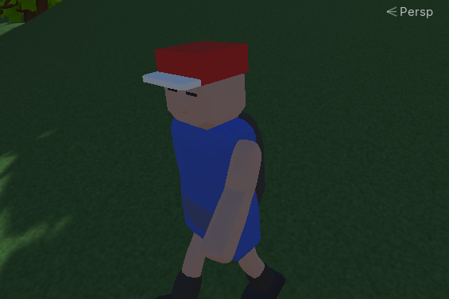

### 023. PlayerRun.cs

 

#### 스크립트 설명
- FPS 방향키를 이용하여 오브젝트를 간단하게 조작하고, 달리기 애니메이션 동작 여부를 결정하는 스크립트.

#### 사용 방법
1. FirstCharacter_fix2.fbx 파일을 유니티 프로젝트에서 임포트시킨다.
2. 해당 fbx 파일을 선택하고 Inspector의 Model 에서 Scale Factor를 0.15로 조절한다.
3. Inspector의 Animation의 Clips에서 char_idle, char_run의 Loop Time 항목을 체크한다.
4. Animator Controller를 만든다. (이름은 PlayerAnimation)
5. Animator 창에다가 char_idle, char_run 순으로 드래그한다.
6. Animator의 Parameters에서 isRun 이라는 BOOL 변수를 추가한다.
7. (Entry) -> (Armature|char_idle) <-> (Armature|char_run) 이와 같은 관계가 되도록 설정
	(참고 : 항목에다가 마우스 우클릭을 눌러 Make Transition을 이용하여 관계를 이어주면 됨)
8. Armature|char_idle -> Armature|char_run의 Transition(화살표)를 눌러  Conditions 항목을 추가하여 isRun, true를 선택한다.
9. Armature|char_idle <- Armature|char_run의 Transition(화살표)를 눌러  Conditions 항목을 추가하여 isRun, false를 선택한다.
10. Hierarchy에서 빈 오브젝트를 생성한다 (이름 : Player)
11. Player에 FirstCharacter_fix2.fbx 프리팹을 추가한다. (반드시 프리팹을 Player에다가 바로 드래그 앤 드롭 해줄것)
12. Player에 Capsule Collider 컴포넌트를 추가한다. (Radius는 0.5, Height는 2로 조절)
13. Player의 FirstCharacyer_fix2에 Animator 컴포넌트를 추가한다.
14. Animator의 Controller에 PlayerAnimation을 추가한다.
15. Player에 Rigidbody 컴포넌트를 추가한다. (Constraints의 Freeze Rotation 항목을 모두 체크한다)
16. Player에 PlayerRun.cs 스크립트를 추가한다.

#### 블랜더 사용 및 임포트 방법
 * 캐릭터 모델링 만들 때 반드시 십자로 선 상태로 만들어두어야 함.

1. Shift + A -> Mesh에 있는 오브젝트들을 통해 캐릭터를 제작한다.
2. 오브젝트의 형상을 원하는 형태로 바꾸고 싶다면 오브젝트 클릭 -> Tab 키를 누른다.
3. 오브젝트를 마우스 우클릭 후 Subdivide를 눌러 적절하게 쪼개준다.
4. 점, 선, 면 선택 방식을 이용하여 변형을 원하는 부분을 클릭하여 조절해준다.
5. 부드럽게 모델링하고 싶은 경우 선을 이용하여 뾰족한 부분을 선택하고 Ctrl + B를 눌러 조절한다. (마우스 휠 이용 권장)
6. 오브젝트 이동은 G키, 회전은 R키, 크기는 S키를 눌러 조절 가능. (예시로 X축만 조절하고 싶다면 X키를 클릭)
7. 번호키 1, 3, 7 키를 이용하여 이동,회전,크기를 더욱 정확하게 조절할 수 있음.
8. 모델링 작업이 끝났다면 골격을 설치하기 위해 Shift + A 클릭 후 Amature 클릭.
9. 골격을 Body에 위치시킨 다음 Tab를 눌러 원형 부분을 클릭하여 길이 조절
10. Shift를 눌러 Body와 관련된 오브젝트들을 모두 선택한 다음 골격 선택 후 Ctrl + P키를 눌러 Bone을 선택
10. 원형 부분을 다시 클릭하여 E키를 눌러 머리, 팔, 다리를 위한 골격을 순차적으로 생성 (한꺼번에 해서는 안 됨. 뼈는 반드시 심어준 다음 다음 관절의 뼈를 심어줄 것)
11. 뼈를 새로 생성했다면 해당 뼈를 입혀줄 오브젝트들을 모두 선택하고 골격 선택 후 Ctrl + P키를 눌러 Bone Relative 선택
12. 상단의 Animation 탭 선택 후, 타임라인(하단 창)에서 Action Editor로 설정
13. 일단 현재 캐릭터의 동작(십자로 선 상태)를 위한 애니메이션을 따로 저장해두어야 함. (이름 : char_normal)
14. 그 후 다른 동작을 위한 애니메이션 파일을 생성하여 애니메이팅 작업.
15. Export 이전에 캐릭터의 위치를 중심으로 조절해둘 것.
16. 애니메이팅 작업 후 캐릭터의 동작을 char_normal 상태로 설정한 다음 Export한다. (FBX 형식으로 저장)
17. FBX파일을 유니티에 임포트한다.

#### 배운 내용
- 블랜더를 이용하여 캐릭터 만드는 방법 (기본)
- Transform, Animator 관련 기능(메소드) 복습

#### 참고 사항
- Animator에서 특정 Transitions의 Conditions 설정 시 조건을 추가할 때 파라미터가 없는 상태에서도 추가되는데 해당 Conditions항목도 조건문으로 취급하여 애니메이션이 제대로 동작하지 않을 수도 있음.
- 블렌더 애니메이팅 작업 시 중간에 작업을 잘못하거나 십자 형태로 캐릭터를 두지 않으면 나중에 유니티에서 불러올 때 문제가 발생할 수 있음.

#### 참고 자료
- [블랜더 선 부드럽게 만들기](https://itadventure.tistory.com/140)
- [블랜더 애니메이션 만들기](https://dlgnlfus.tistory.com/326)
