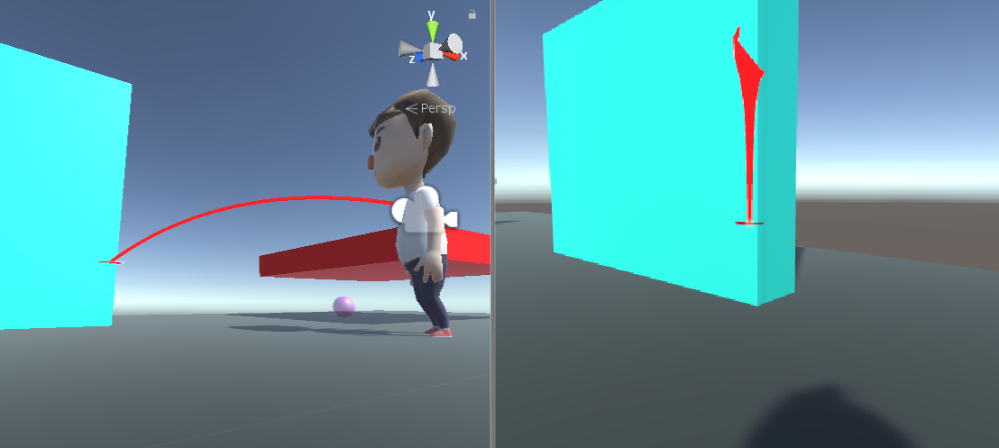

### 024. DrawParabola.cs, RaycastCam.cs

 

#### 스크립트 설명 
	- 플레이어가 바라본 위치를 기준으로 포물선을 그려주는 스크립트

#### 사용 방법 
	1. Hierarchy에서 Main Camera를 선택한다.
	2. 기존 DrawLine 스트립트를 비활성화하고, DrawParabola 스크립트를 적용한다.
	3. 기존 RaycastCam 스크립트를 이번 커밋에 첨부된 RaycastCam으로 변경한다.

#### 주의사항 
	- 본 스크립트는 이전에 완료하였던 실험과 연계되어 진행됨. (문서 021, 022 참고)
	- 캐릭터를 FPS 방식으로 조종할 수 있어야 함. 
	- DrawLine.cs는 반드시 Main Camera에 포함되어 있어야 함.
		- 활성화 여부는 무관함.
		-  DrawLine의 lineDistance를 이용하여 RaycastCam 스크립트에서 감지 거리를 결정하므로 반드시 필요함.

#### 배운 내용 
	- 포물선 그리는 방법

#### 참고 사항 
	- 반복문을 이용하여 포물선을 그릴 때 LineRenderer의 Size를 반복문의 인덱스에 맞춰서 설정해주어야 함.
	- 관련 에러 : LineRenderer.SetPosition index out of bounds

#### 참고 자료 
	- [포물선 그리기](https://lovelyseekerclaire.tistory.com/26)
	- [LineRenderer.SetPosition index out of bounds 에러 해결방법](https://answers.unity.com/questions/1341993/linerenderersetposition-index-out-of-bounds-help.html)