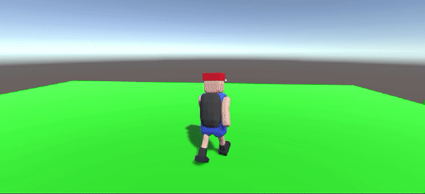

### 024. DrawParabola.cs, RaycastCam.cs

 

#### 스크립트 설명 
	- 플레이어의 이동, 회전, 점프를 조작할 수 있음. (프레임 보정 사용)
	- 플레이어의 이동/회전에 따라 카메라가 플레이어 뒤에서 부드럽게 따라옴.

#### 사용 방법 
	1. Hierarchy에서 Cube 생성 (이름 : Floor)
	2. Floor의 Position(0, 0, 0), Scale(20, 0.5, 20)으로 설정
	3. Floor의 Tag를 "Floor"로 설정 (태그 없을 시 생성 필요)
	4. Hierarchy에서 빈 오브젝트 생성 (이름 : Player)
	5. Player에 Rigidbody, Capsule Collider, CharMove.cs 컴포넌트 추가

#### 주의사항
	- 애니메이션 코드도 포함되어 있음. (023번 문서의 fbx 캐릭터 모델 파일 사용 권장)
		- fbx 적용 방법 관련된 사항은 023번 문서 참조 바람.
	- 애니메이터 구현방법은 별도로 설명하지 않았음.

#### 배운 내용 
	- 스크립트에서 빈 오브젝트 생성 방법
	- Lerp(선형 보간)을 이용한 부드러운 이동/회전 방법
	- rotation과 eulerAngles의 회전값 차이에 관한 이해
	- 기존 이동/회전/점프에 관한 복습

