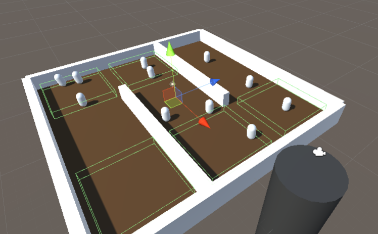

### 026. SpawnEnemy.cs, EnemyMove.cs

 

#### 스크립트 설명 
	- SpawnEnemy.cs : 2~5초 간격으로 적을 생성하는 스크립트 (트리거 이용)
	- EnemyMove : 트리거에 따라 적이 이동하는 스크립트 (각 이동 경로마다 적(Enemy)은 해당 경로 범위 내에서 랜덤한 위치를 타깃으로 삼고 이동함) 

#### 사용 방법 
	1. Hierarchy에서 빈 오브젝트를 생성 (이름을 SpawnPoint로 변경)
	2. SpawnPoint에 BoxCollider 생성. (isTrigger체크 필수, 사이즈는 원하는 만큼 조절)
	3. SpawnPoint에 SpawnEnemy.cs 스크립트를 추가한다.
	4. Hierarchy에서 빈 오브젝트 생성 (이름은 MovePoint1로 변경)
	5. MovePoint1에 BoxCollider 생성 (isTrigger체크 필수, 사이즈는 원하는 만큼 조절)
	6. 이동 경로를 더 주고 싶을 경우 MovePoint1을 복사해서 MovePoint2로 수정한다. (3번째 경로를 만들 때도 MovePoint3 이 방식대로 할 것)
	7. Hierarchy에서 3D Object -> Capsule을 선택하고 이름은 Enemy로 변경한다.
	8. Enemy에 Rigidbody 컴포넌트와 EnemyMove.cs 컴포넌트를 추가한다. (MoveSpeed는 2, RotateSpeed는 1.5로 설정하길 권장함)
	9. Enemy를 프리팹화 시킨다. (Hierarchy의 Enemy를 Project 폴더로 드래그 앤 드롭)
	10. SpawnPoint의 SpawnEnemy에서 EnemyPrefab의 빈 항목에 방금 만든 프리팹을 추가한다..

#### 주의사항
	- 다음 경로 감지는 Hierarchy에 존재하는 "MovePoint"라는 이름을 찾아서 인덱스 방식으로 감지함.

#### 배운 내용 
	- 트리거, 이동 스크립트를 활용하여 이동 로직 만드는 방법

