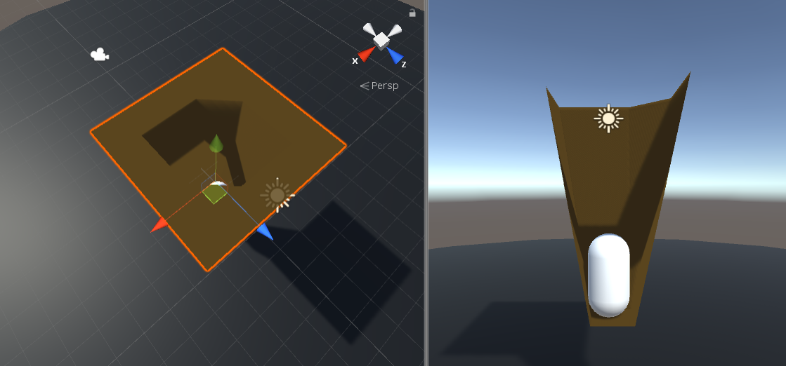

### 029. MeshGenerator2.cs

#### 스크립트 설명 
	- Mesh의 특정 포인터들의 y축이 서서히 감소하여 구멍을 형성하는 스크립트

#### 사용 방법 
	1. Hierarchy에서 빈 오브젝트 생성
	2. 빈 오브젝트에 대하여 다음과 같은 컴포넌트를 추가
		- Mesh Renderer
		- Mesh Generator2.cs
	3. Material을 생성
	4. 생성한 Material의 셰이더는 Nature/Tree Creator Leaves Fast로 설정
	5. Material의 Shadow Strength를 1로 설정
	6. 해당 Material을 빈 오브젝트의 Mesh Renderer -> Element0에 드래그 앤 드랍
	7. Mesh Generator2의 X Scale, Z Scale은 반드시 5로 설정

#### 배운 내용 
	- Mesh Filter 이용하는 방법
	- Mesh Renderer에 관한 이해
	- Mesh 조작 & 갱신 방법
	

#### 참고 자료
 - [MESH GENERATOR 1 - Brackeys](https://www.youtube.com/watch?v=eJEpeUH1EMg)
 - [MESH GENERATOR 2 - Brackeys](https://www.youtube.com/watch?v=64NblGkAabk)
 - [How to Update Mesh Collider](https://answers.unity.com/questions/193630/modify-mesh-collider-when-modifying-vertices.html)

