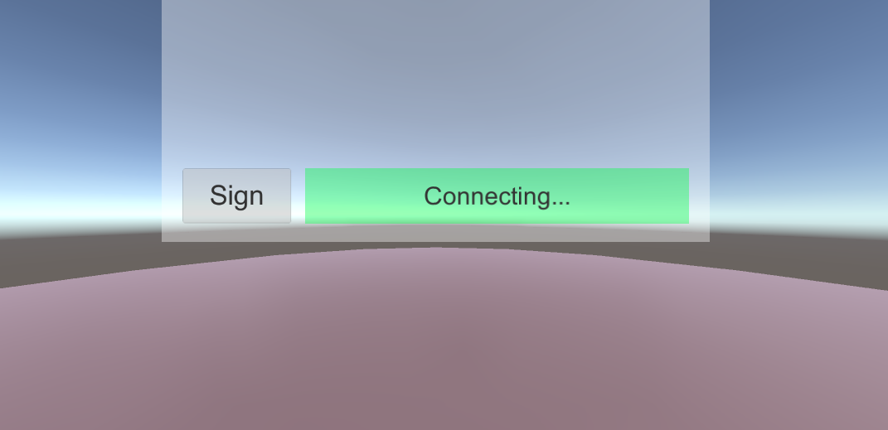

### 031. FirebaseLoginManager.cs

#### 스크립트 설명 
	- 파이어베이스와 연동하여 파이어베이스로부터 데이터를 받아올 수 있는지 검사하여 결과를 UI에 보여주는 스크립트

#### 사용 방법 
	1. 세팅 작업
		- Hierarchy에서 Cylinder 오브젝트 생성 (위치는 모두 0, 크기는 (20, 0.5, 20))
		- Hierarchy에서 Player라는 이름의 빈 오브젝트 생성 (위치는 (0, 2, 0))
		- Player에게 Main Camera 혹은 OVRCameraRig를 넣는다. (카메라 로컬 위치는 모두 0)
		
	2. UI 세팅
		- Hierarchy에서 UI_canvas라는 이름의 UI Canvas 오브젝트를 생성 
			- Rect Transform 컴포넌트 : Pos (0, 6, 8), Width(20), Height(10)
			- Canvas 컴포넌트 : Render Mode를 World Space로 변경
			- FirebaseLoginManager 컴포넌트 추가

		- UI_canvas에 UI_panel라는 이름의 UI Panel 오브젝트를 생성
			- Image 컴포넌트 : Source Image를 None으로 설정

		- UI_panel에 SignButton라는 이름의 UI Button 오브젝트를 생성
			- Rect Transform 컴포넌트 : Pos (-7.25, -3.33, 0), Width(200), Height(100), Scale(0.02, 0.02, 0.02)
			- Rect Transform 컴포넌트의 Anchor Presets : center & middle
			- Button 컴포넌트의 On Click( ) : 빈칸 오브젝트에 UI_canvas를 넣고, 함수는 FirebaseLoginManager -> signButtonClick( )으로 설정
			- SignButton의 Text(자식)에서 Text를 Sign으로 바꾸고, 폰트 크기는 50으로 설정. Alignment는 모두 가운데로 설정

		- UI_Canvas에 LogPanel라는 이름의 UI Panel 오브젝트를 생성
			- Rect Transform 컴포넌트 : Pos (2.25, -3.33, 0), Width(14), Height(2)
			- Rect Transform 컴포넌트의 Anchor Presets : center & middle
			- Image 컴포넌트 : Source Image는 None으로, Color는 UI_panel과 구별되는 색상으로 설정

		- LogPanel에 LogText라는 이름의 UI Text 오브젝트를 생성
			- Rect Transform 컴포넌트 : Pos (0, 0, 0), Width(450), Height(60), Scale(0.03, 0.03, 0.03)
			- Text 컴포넌트 : 폰트 크기는 30, Alignment는 모두 가운데로 설정

#### 연출 과정
	- 어플리케이션을 실행할 경우 Sign 버튼을 먼저 비활성화로 만들어서 접근을 제한한다.
	- 처음에는 Ready... 상태를 보인 뒤 연결을 시도할 때 Connecting... 상태가 된다.
	- 연동에 실패할 경우 Connection false 상태가 되고, 연동에 성공하면 Connection OK 상태가 되면서 버튼이 활성화된다.
	- 버튼이 활성화되었을 때 버튼을 누르면 어플리케이션이 종료된다. (코드상에서 종료되게 설정해놓음)

#### 주의사항
	- 본 작업은 Oculus Go에서 제대로 구동되는지 확인하기 위해 해당 플랫폼을 기반으로 구현하였음.
	- 파이어베이스와 관련된 설치 방법, 연동 방법을 모두 알고있다고 가정함. (방법은 별도로 기재하지 않음)
	- Oculus Go에서 실험해본 결과, 해당 플랫폼에서는 Google Play를 지원하지 않아서 파이어베이스와 연동 불가능함.
	- 유니티 내에서 테스트할 경우 Connecting... 상태 이후 아무런 변화가 일어나지 않는 현상이 발견됨.

#### 에러 해결
	* Unable to sign the application please provide password 에러 발생 시
		- Edit -> Project Settings 에서 Publish Settings를 선택하고, Project Keystore와 Project Key에 대한 패스워드를 입력한다.

	* 빌드 중 Resolving Android Dependencies가 나타나면서 멈추는 현상
		- Assets -> Play Services Resolver -> Android Resolver -> Force Resolve를 통하여 해결

#### 배운 내용 
	- Firebase 연동 방법
	

#### 참고 자료
 - [유니티 포톤+파이어베이스 관련 유튜브 영상](https://www.youtube.com/watch?v=mP6IscbNxOA)
 - [Resolving Android Dependencies 멈춤 현상 해결방법](https://m.blog.naver.com/PostView.nhn?blogId=progagmer&logNo=221375763262&proxyReferer=https%3A%2F%2Fwww.google.com%2F)
 - [Oculus go & Firebase 관련 자료](https://qiita.com/yakimeron/items/f10de5d2950e8236e80c)
