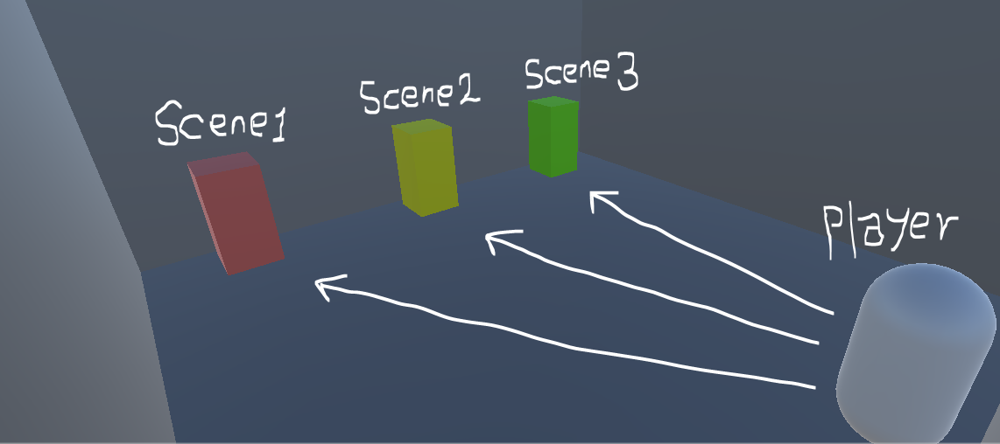

### 032. PortalScene.cs, PlayerMove.cs

#### 스크립트 설명 
	- 이 스크립트를 적용한 오브젝트에 충돌할 경우 스크립트에서 준 값에 따라 각각 다른 Scene을 로드하는 스크립트

#### 사용 방법 
	1. Assets에 다음과 같은 폴더들을 만든다.
		- Materials	// 머터리얼 전용 폴더
		- Prefabs		// 프리팹 전용 폴더
		- Scenes		// 씬 전용 폴더
		- Scripts		// C# 스크립트 전용 폴더

	2. Material 폴더에서 4개의 머터리얼을 생성한다.
		- Red (색상은 빨강)
		- Yellow (색상은 노랑)
		- Green (색상은 초록)
		- Wall (색상은 회색)

	3. Player 프리팹을 만들기 위해 다음과 같은 절차를 따른다.
		- Hierarchy에서 빈 오브젝트 생성 (이름 : Player)
		- Player Transform.Position : (0, 2, -5)
		- Player에게 PlayerMove 스크립트를 추가
		- Player의 자식 오브젝트를 지정함
			- Capsule 오브젝트를 생성하여 Player의 자식으로 두기 (로컬 좌표는 모두 0)
			- Main Camera 오브젝트를 Player의 자식으로 두기 (로컬 좌표는 모두 0)
		- 위 절차를 모두 완료하였다면 Player 오브젝트를 Prefabs 폴더에 집어넣는다.

	4. Wall 프리팹을 만들고 내부 공간을 만들기 위해 다음과 같은 절차를 따른다.
		- Hierarchy에서 Cube 생성 (이름 : Wall)
		- Wall Transform.Scale : (12, 0.5, 12)
		- 위 절차를 모두 완료하였다면 Wall 오브젝트를 Prefabs 폴더에 집어넣는다.
		- 그 후 Wall 프리팹을 5번 Hierarchy에 추가하여 다음과 같이 위치를 설정한다.
			- Wall 1번 좌표(P), 회전값(R) : P(0, 0, 0), R(0, 0, 0)
			- Wall 2번 좌표(P), 회전값(R) : P(0, 6, -6), R(90, 0, 0)
			- Wall 3번 좌표(P), 회전값(R) : P(0, 6, 6), R(90, 0, 0)
			- Wall 4번 좌표(P), 회전값(R) : P(6, 6, 0), R(0, 0, 90)
			- Wall 5번 좌표(P), 회전값(R) : P(-6, 6, 0), R(0, 0, 90)
			- Wall 6번 좌표(P), 회전값(R) : P(0, 12, 0), R(0, 0, 0)

	5. PortalCube 프리팹을 만들고 씬 설정을 위해 다음과 같은 절차를 따른다.
		- Hierarchy에서 Cube 생성 (이름 : PortalCube)
		- PortalCube Transform.Position : (0, 1.25, 5)
		- PortalCube Transform.Scale : (1, 2, 1)
		- PortalCube에게 PortalScene 스크립트를 추가한다.
		- 위 절차를 모두 완료하였다면 PortalCube 오브젝트를 Prefabs 폴더에 집어넣는다.
		- 그 후 PortalCube 프리팹을 2번 Hierarchy에 추가하여 다음과 같이 위치와 입힐 Material, 스크립트의 PortalNumber 값을 설정한다.
			- PortalCube 1번 좌표(P), 머터리얼(M), PortalNumber 값(Pnum) : P(-4, 1.25, 5), M(Red), Pnum(1)
			- PortalCube 2번 좌표(P), 머터리얼(M), PortalNumber 값(Pnum) : P(0, 1.25, 5), M(Yellow), Pnum(2)
			- PortalCube 3번 좌표(P), 머터리얼(M), PortalNumber 값(Pnum) : P(4, 1.25, 5), M(Green), Pnum(3)

	6. 현재 작업중인 씬을 Assets/Scenes 폴더에 저장한다. (이름은 반드시 MainScene으로 저장한다.)

	7. Assets/Scenes 폴더에 3개의 Scene을 생성한다.
		- Scene1
		- Scene2
		- Scene3

	8. 생성한 3개의 씬을 하나씩 넣어서 다음과 같은 작업을 해준다.
		- Hierarchy에 Player, PortalCube, Wall 프리팹을 추가한다.
		- Wall 색깔은 Scene1은 Red, Scene2는 Yellow, Scene3는 Green으로 설정한다. (구별을 위함)
		- PortalCube의 PortalScene 스크립트에서 PortalNumber가 0으로 되어있는지 확인한다.

	9. File - Build Settings를 누른 뒤 Scenes 폴더에 있는 씬들을 Build Settings의 Scenes In Build에 드래그 앤 드롭한다.

	10. 플레이 버튼을 눌러서 플레이어를 조작하여 아무 PortalCube 오브젝트에 부딪쳐본다.

#### 연출 과정
	- Portal Number가 0인 오브젝트에 충돌할 경우 -> MainScene 씬을 로드함
	- Portal Number가 1인 오브젝트에 충돌할 경우 -> Scene1 씬을 로드함
	- Portal Number가 2인 오브젝트에 충돌할 경우 -> Scene2 씬을 로드함
	- Portal Number가 3인 오브젝트에 충돌할 경우 -> Scene3 씬을 로드함

#### 배운 내용 
	- Scene 기본 구현 이해
