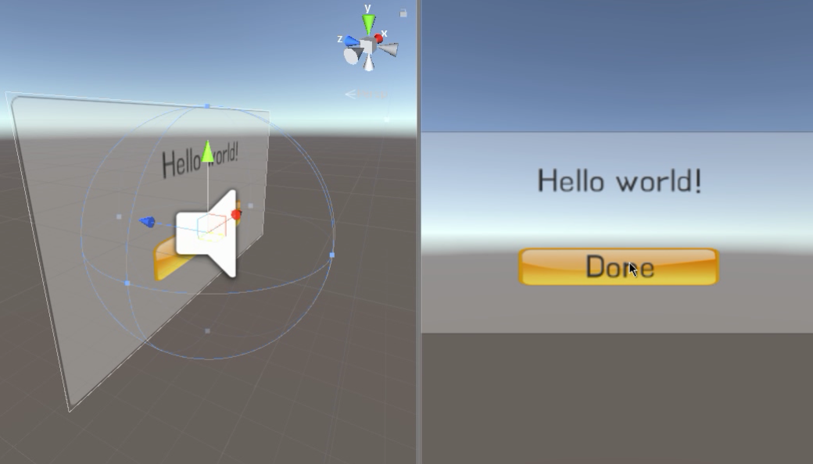

### 035. UI 나타내기 효과 테스트

#### 스크립트 설명 
	- UIEffect.cs : 코루틴 함수와 Lerp를 활용하여 UI를 부드럽게 나타내거나 숨기는 효과를 표현한 스크립트

#### 사용 방법 
	1. 아래 오브젝트들을 생성
		- Canvas (Width : 300, Height : 150, Scale : (0.01, 0.01, 0), Render Mode -> World Space)
			- Panel (변경사항 없음.)
			- Text (Width : 300, Height : 150)
			- Button (Width : 160, Height : 30)
				- Text

		- 빈 오브젝트 생성 (UIEffectManager)

	2. UIEffectManager에게 UIEffect.cs 스크립트 적용 및 Audio Source 컴포넌트 추가.
	3. UIEffect에서 Menu Sound, Click Sound를 정할 것. (사운드 파일)
	4. Button의 On Click ( ) 에서 오브젝트 빈칸에 UIEffectManager를 추가 후 이벤트를 UIEffect.OnDoneButtonClick 로 설정한다.
	5. 유니티 내에서 실행하여 "ESC" 키룰 눌러서 UI 창이 나타나는 모습을 확인한다.

#### 발견된 문제
	- 버튼 오브젝트 사용 시 간혹 유니티에서 게임을 플레이 중에 버튼이 동작하지 않는 경우가 있음.
		-> 이 경우 EventSystem 오브젝트가 Hierarchy에 존재하는지 확인해야 함.
		-> 만약 EventSystem이 존재하는데도 불구하고 동작하지 않을 경우 다시 새로 버튼을 만들어야 함.

#### 배운 내용 
	- EventSystem의 용도 확인 및 버튼 클릭 Raycast 관련 오류 해결 방법
