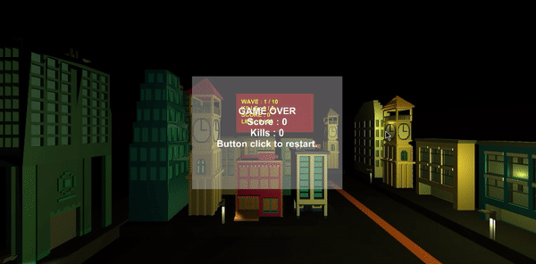

### 036. 로딩 씬 제작 테스트

#### 스크립트 설명 
	- LoadingProcess.cs : 로드할 씬을 비동기 로드하여 로드가 완료되기 전까지 로딩 씬에서 현황을 보여주는 스크립트

#### 사용 방법 
	1. 카메라 오브젝트를 원점에 위치시킨다.

	2. Canvas를 생성하고 아래와 같이 변경한다.
		- Name : LoadingCanvas
		- Canvas 컴포넌트의 Render Mode : World Space
		- Rect Transform Width, Height : (300, 150)
		- Rect Transform Scale : (0.01, 0.01, 0.01)

	3. LoadingCanvas에 Panel를 생성하고 이름을 LoadingPanel로 변경한다.

	4. LoadingCanvas에 Slider를 생성하고 아래와 같이 변경한다.
		- Name : LoadingBar
		- Rect Transform Position : (0, -50, 0)
		- Rect Transform Width, Height : (280, 20)
		- LoadingBar -> Background의 Rect Transform :
			Left : -3.9 | Top : 0 | Pos Z : 0 | Right : 3.9 | Bottom : 0 | Scale : (0.96, 1, 1)
		- Slider 컴포넌트의 Value : 0

	5. 프로그레스 바와 관련된 오브젝트들을 변경한다.
		* LoadingBar -> Fill Area -> Fill
			- Rect Transform.Width = 10

	6. LoadingCanvas에 Text를 생성하고 아래와 같이 변경한다.
		- Name : LoadingText
		- Rect Transform Width, Height : (300, 150)
		- Text 컴포넌트에 아래 사항을 변경
			- Font Size : 30
			- Alignment : 모두 가운데로 설정

	7. 빈 오브젝트를 생성하여 아래와 같이 변경한다.
		- Name : LoadingManager
		- LoadingProcess 컴포넌트 추가 (스크립트)

	8. Window -> Rendering -> Light Setting에서 Skybox Material을 None 혹은 검은 머터리얼로 설정한다.

#### 주의사항
	- 비동기로 로드할 씬은 사용자가 임의로 변경해주어야 함. (스크립트상 "ShootingDefenceProject" 씬을 불러오도록 되어 있음)

#### 발견된 문제
	- allowSceneActivation을 false로 할 경우 process가 0.9에서 멈추는 현상이 발생함.

#### 배운 내용 
	- 기본 자료형(float)에 대한 선형 보간 방법
	- 씬을 비동기로 로드하여 로딩 화면 구현하는 방법
	- UI 슬라이더 다루는 방법

#### 참고 자료
 - [유니티 API 문서 : LoadLevelAsync](https://docs.unity3d.com/kr/530/ScriptReference/Application.LoadLevelAsync.html)
 - [AsyncOperation 사용법 및 비동기 장면 전환 방법](https://m.blog.naver.com/pxkey/221307916592)
 - [비동기 씬 전환 90% 멈춤 현상 문제 해결 방법](https://blog.naver.com/developer_hyw/221043427652)
