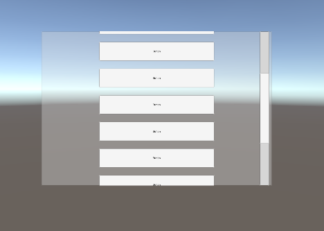

### 038-2. Scrollbar, Mask 테스트

#### 사용 방법 
	1. Canvas 오브젝트 생성 
		- <Canvas>의 Render Mode를 World Space로 설정
		- <Rect Transform>에서 아래와 같이 설정
			- Position : (0, 0, 5)
			- Width, Height : (1200, 800)
			- Scale : (0.01, 0.01, 0.01)

	2. Canvas에 Panel 오브젝트 생성
		- <Mask> 컴포넌트 추가 (Panel 영역을 벗어나는 오브젝트는 안 보이게 됨.)
		- <Scroll Rect> 컴포넌트 추가

	3. Panel에 빈 오브젝트 생성 후 List로 이름 변경
		- <Vertical Layout Group> 컴포넌트 추가 (Child Alignment는 Upper Center로 설정함)

	4. Panel에 버튼 생성하여 아래와 같이 설정한 뒤 복사/붙여넣기 여러번 수행
		- <Rect Transform> 에서 아래와 같이 설정
			- Width, Height : (600, 100)
		
	5. Canvas에 Scrollbar 오브젝트 추가
		- <Rect Transform> 에서 아래와 같이 설정
			- Width, Height : (50, 800)
			- Position : (560, 0, 0)

	6. Canvas의 <Scroll Rect> 컴포넌트에서 아래와 같이 설정
		- Horizontal, Vertical의 체크를 모두 해제
		- Vertical Scrollbar : Scrollbar 오브젝트 추가
		- Content : List 오브젝트 추가

#### 배운 내용 
	- 스크롤바 활용 방법 및 Mask에 관한 이해

#### 참고 사항
 - [unity ugui scrollRect - scrollBar 강좌](https://www.youtube.com/watch?v=dJKP31q6Vs8)
