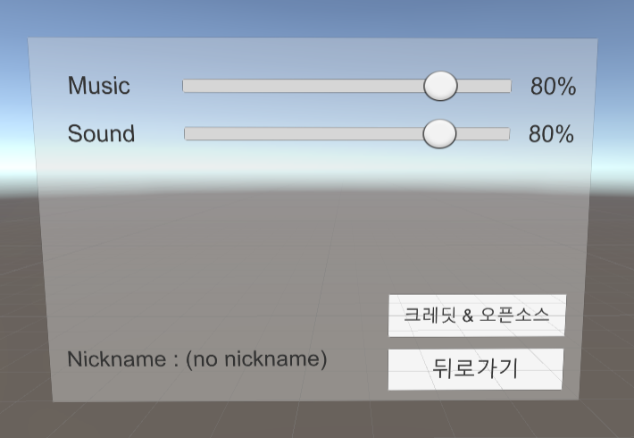

### 038. 스크롤바 이벤트 테스트

#### 스크립트 설명 
	- SoundSetting.cs : 스크롤바의 값이 변경될 경우 리스너에 등록한 이벤트 함수가 호출되어 스크롤바의 값을 표시해주는 스크립트

#### 사용 방법 
	- Canvas 오브젝트 생성
		- <Canvas> 컴포넌트의 Render Mode를 "World Space"로 변경
		- <Rect Transform>의 모든 Pos를 0, Width를 1200, Height를 800으로 설정, 모든 Scale을 0.01로 설정

	- Canvas에 Panel 오브젝트 생성
		- <Box Collider> 컴포넌트 생성 후 Size를 (1200, 800, 0)으로 설정

	- Canvas에 Scrollbar 오브젝트 생성 (Name : MusicBar)
		- <Rect Transform>의 Pos를 (70, 300, 0), Width를 700, Height를 30으로 설정
		- <Scrollbar> 컴포넌트에서 Size를 0.03으로 설정
		- 자식 오브젝트(Sliding Area)의 <Rect Transform>에서 아래와 같이 설정
			- Left : 10, Top : 10, Pos Z : 0, Right : 10, Bottom : 10
		- Sliding Area의 자식 오브젝트의 <Rect Transform>에서 아래와 같이 설정
			- Left: -30, Top : -30, Pos Z : 0, Right : -30, Bottom : -30

	- MusicBar에 Text 오브젝트 생성 (name : MusicBarText)
		- <Rect Transform>에서 아래와 같이 설정
			- Pos : (439, 0, 0), Width(150), Height(100)
		- <Text>에서 아래와 같이 설정
			- Font Size : 50
			- Alignment : 모두 중앙으로 설정

	- MusicBar를 복사하여 붙여넣기 후 복사된 이름을 SoundBar로 변경, MusicBarText도 SoundBarText로 변경
		- 위치값은 알아서 조리있게 조절.

	- Canvas에 <SoundSetting> 스크립트를 추가하고 아래와 같이 인스턴스 설정
		- music bar : MusicBar 오브젝트
		- music percent : MusicBarText 오브젝트
		- sound bar : SoundBar 오브젝트
		- sound percent : SoundBarText 오브젝트

#### 배운 내용 
	- 스크롤 바에 리스너 추가 & 이벤트 메소드 만드는 방법

